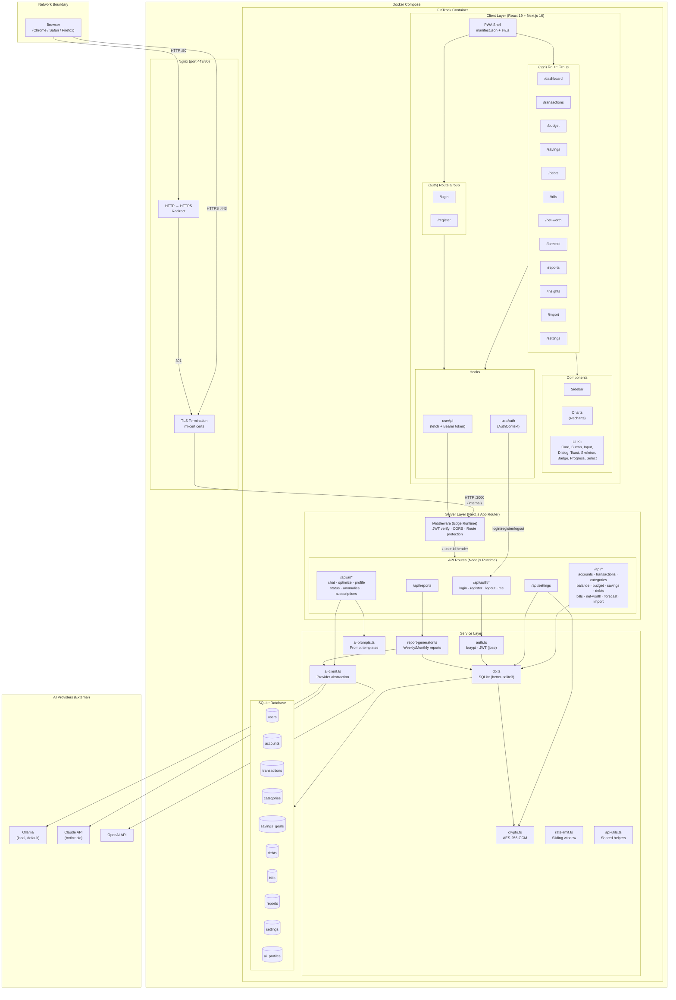
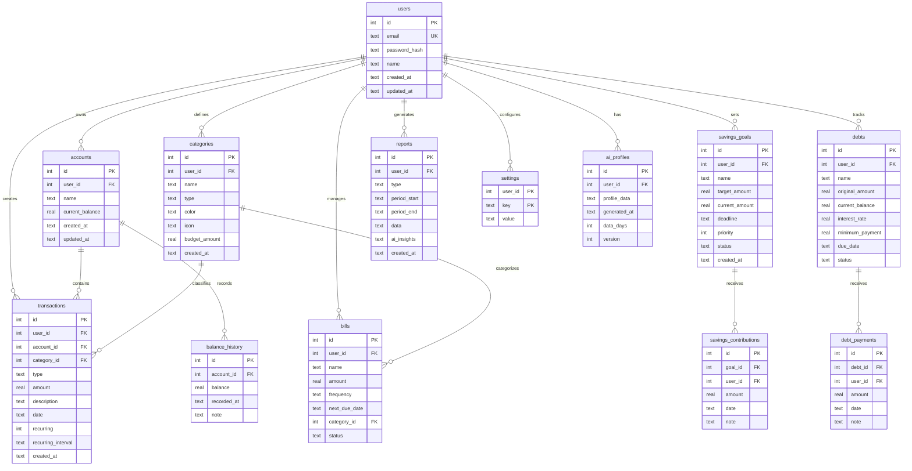
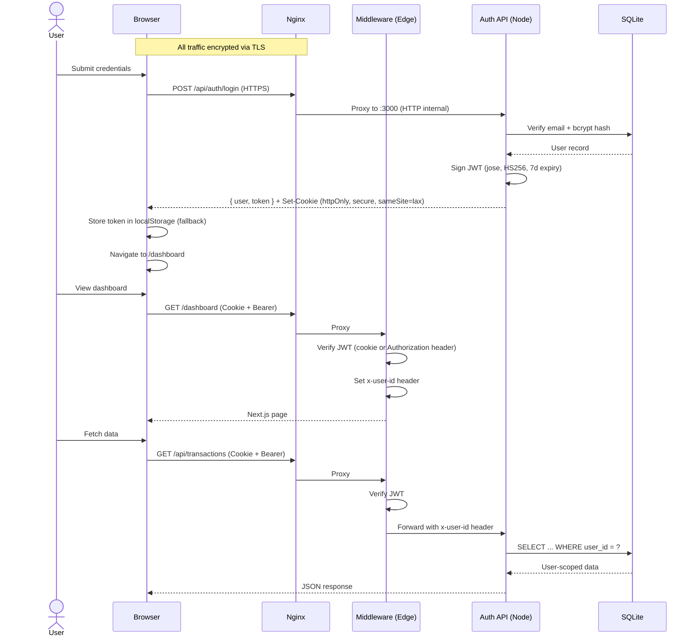
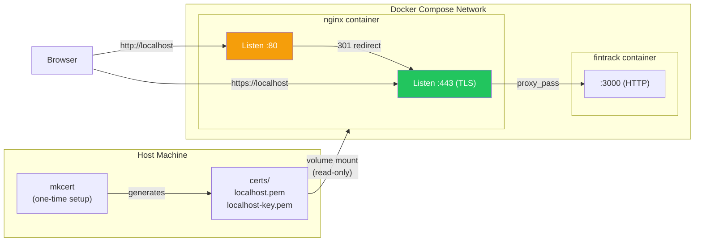
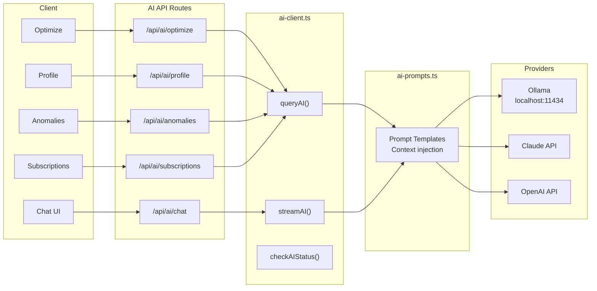
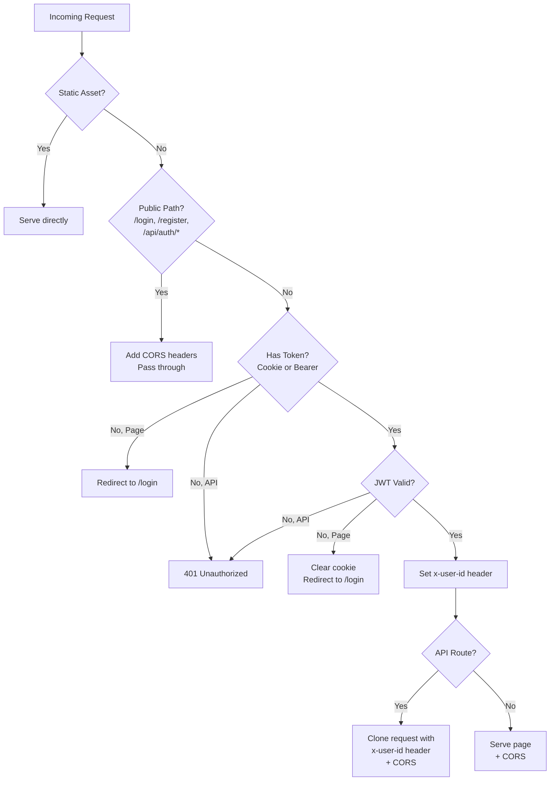

# FinTrack Architecture

## System Overview

## Data Model

## Authentication Flow

## HTTPS Architecture

## AI Integration

## Request Lifecycle

## Technology Stack

| Layer | Technology | Purpose |
|---|---|---|
| Frontend | React 19, Next.js 16 (App Router), Tailwind CSS 4 | UI rendering, routing, styling |
| Charts | Recharts | Balance trends, spending breakdown |
| Icons | Lucide React | Consistent iconography |
| Database | SQLite (better-sqlite3) | Embedded relational storage |
| Auth | bcryptjs (cost 12) + jose (JWT HS256) | Password hashing + stateless sessions |
| Encryption | AES-256-GCM (node:crypto) | API key encryption at rest |
| AI | Ollama / Claude / OpenAI | Financial insights and chat |
| Rate Limiting | Sliding window (in-memory) | Brute-force protection on auth routes |
| TLS | Nginx + mkcert | HTTPS on localhost with trusted certs |
| Container | Docker + Docker Compose | Isolated, reproducible deployment |
| Scheduling | node-cron | Automated weekly/monthly reports |
| PWA | Service Worker + Manifest | Offline caching, installability |
