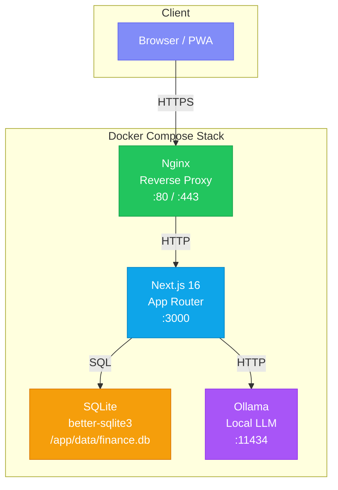
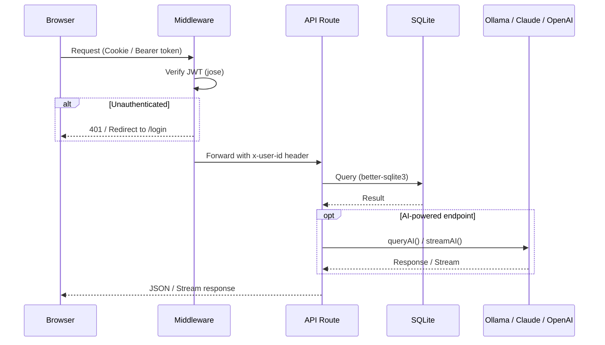
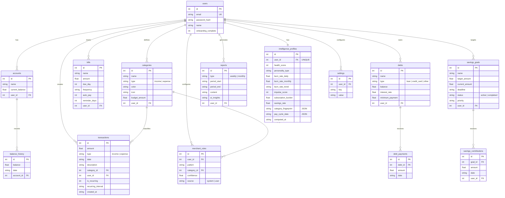
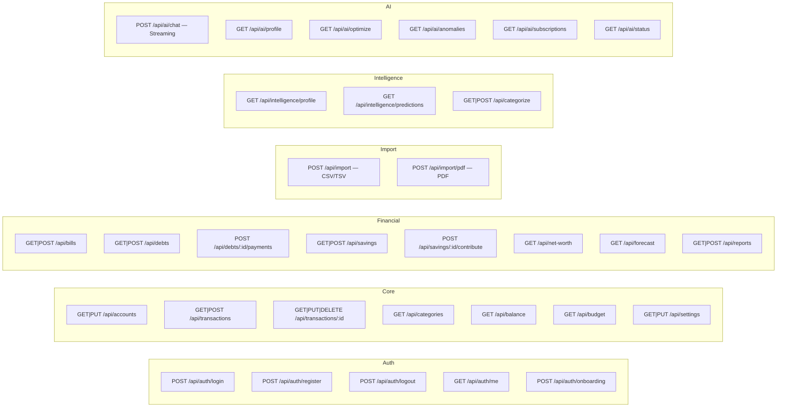
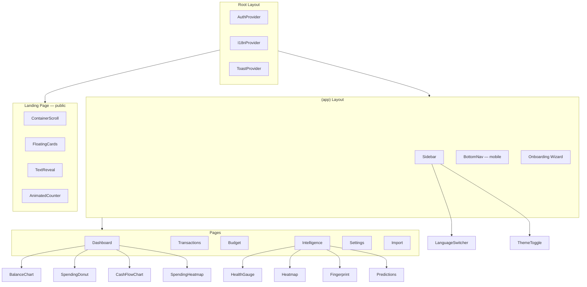
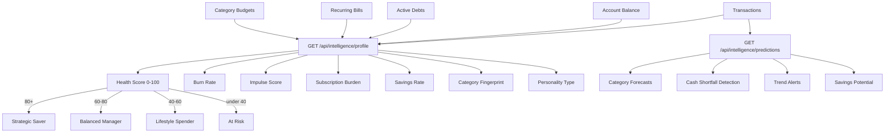
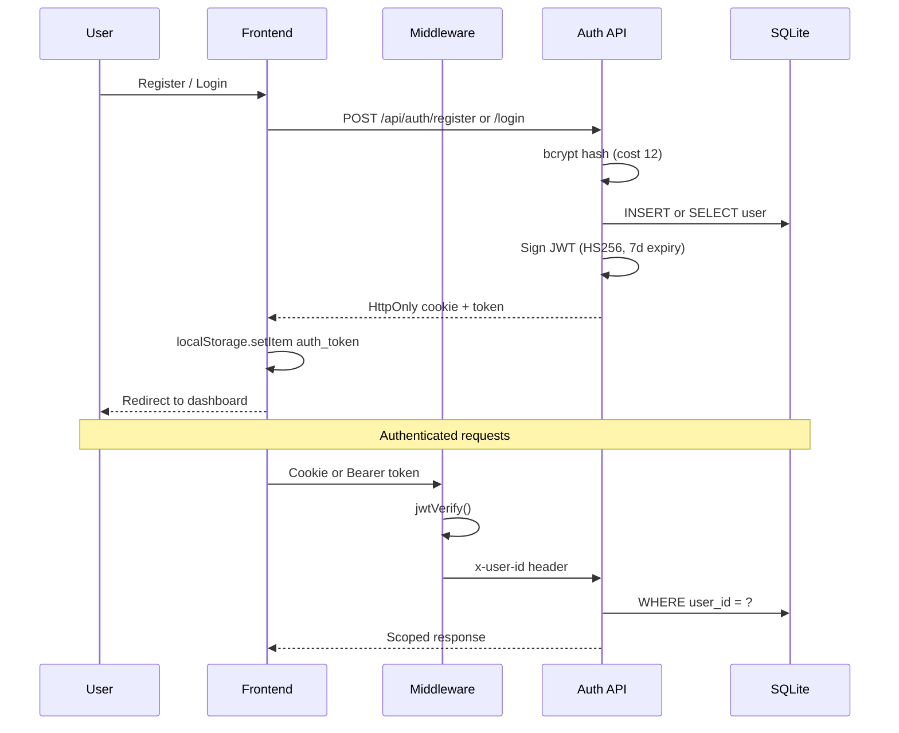
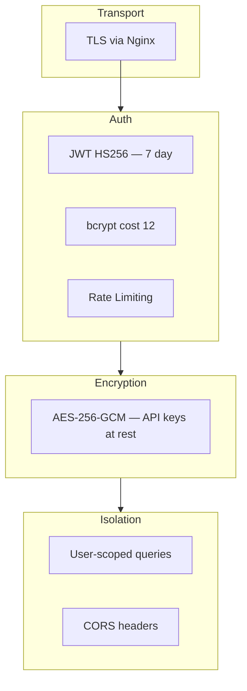

# FinTrack v2 — Architecture

## System Overview

## Request Flow

## Database Schema (ER Diagram)

## API Route Map

## Component Architecture

## Intelligence Engine

## Authentication Flow

## Security

