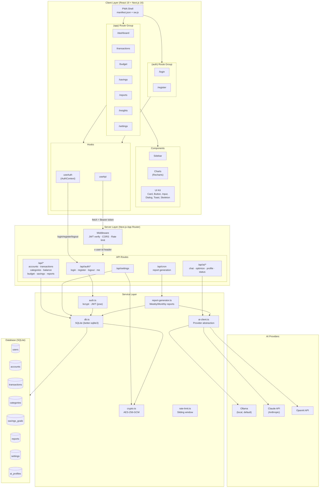
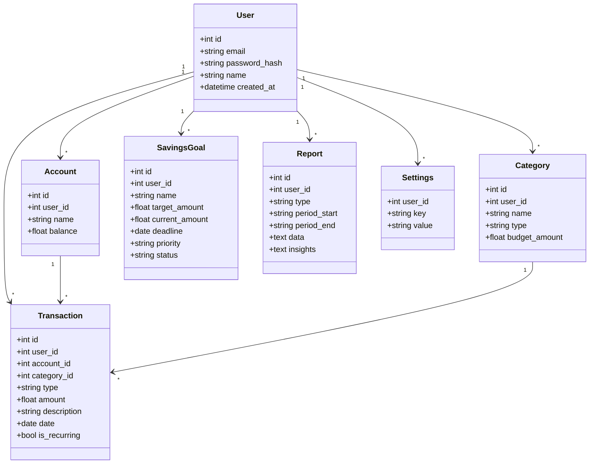
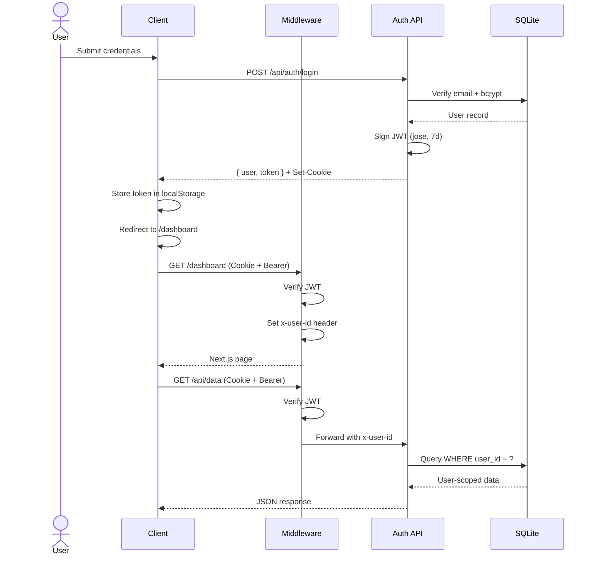
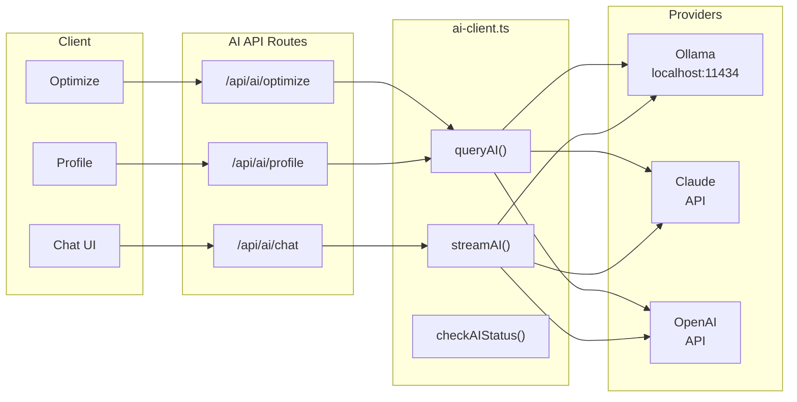

# FinTrack Architecture

## System Overview

## Component Diagram

## Authentication Flow

## AI Integration

## Technology Stack

| Layer | Technology |
|-------|-----------|
| Frontend | React 19, Next.js 16 (App Router), Tailwind CSS |
| Charts | Recharts |
| Icons | Lucide React |
| Database | SQLite (better-sqlite3) |
| Auth | bcryptjs + jose (JWT) |
| Encryption | AES-256-GCM (node:crypto) |
| AI | Multi-provider (Ollama / Claude / OpenAI) |
| Scheduling | node-cron |
| PWA | Service Worker + Web App Manifest |
