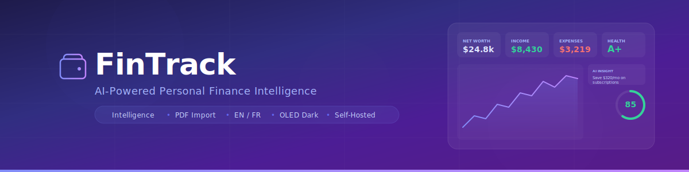

<p align="center">
  
</p>

<p align="center">
  <strong>Self-hosted personal finance tracker with AI intelligence, PDF import, and bilingual support.</strong>
</p>

<p align="center">
  <a href="#quick-start-docker"></a>
  <a href="#ai-setup"></a>
  <a href="#https"></a>
  
  
</p>

---

## Features

| Category | What you get |
|---|---|
| **Dashboard** | KPI hero row (net worth, income, expenses, savings rate) with sparklines, gradient area chart, interactive donut, cash-flow waterfall, GitHub-style spending heatmap |
| **Intelligence Engine** | Financial health score (0–100), spending DNA profile, personality type, impulse score, subscription burden, category fingerprint (50/30/20), pay-cycle analysis |
| **Predictions** | Next-month category forecasts, cash shortfall detection, trend alerts (>15% increase), budget recommendations, savings potential |
| **Smart Categorization** | Auto-categorize imports via merchant rules, learn from manual corrections, fuzzy pattern matching |
| **PDF Import** | Parse bank statement PDFs with regex + AI fallback extraction, confidence scoring, inline editing before import |
| **CSV/TSV Import** | Drag-and-drop with auto column detection, preview table, bulk import |
| **Budgeting** | Per-category budgets, pace indicator (day-of-month progress line), flex mode (Needs/Wants/Savings), budget vs actual chart, rollover visualization |
| **Transactions** | Inline editing, bulk operations (select + categorize/delete), split transactions across categories, smart search with amount filters |
| **Bills & Debts** | Recurring bill reminders, debt tracking with interest rates and payment history |
| **Savings** | Goals with deadlines, contribution tracking, progress bars |
| **Net Worth** | Assets vs liabilities with history chart |
| **Forecasting** | Cash flow projections based on spending patterns |
| **Reports** | Auto-generated weekly/monthly reports with AI narrative |
| **AI Chat** | Streaming financial chat with Ollama, Claude, or OpenAI |
| **i18n** | Full English/French bilingual support with language switcher |
| **Themes** | Light, Dark (glassmorphism), OLED Dark (true black) |
| **Onboarding** | 4-step wizard for new users (name, import, currency, done) |
| **Mobile** | Bottom navigation bar on small screens, responsive layout |
| **Landing Page** | Scroll-animated marketing page with 3D container scroll, floating cards, animated counters |
| **Security** | AES-256-GCM encryption, HTTPS, JWT auth, bcrypt, rate limiting, user-scoped data |
| **PWA** | Installable as progressive web app |

## Tech Stack

| Layer | Technology |
|---|---|
| Frontend | React 19, Next.js 16 (App Router), Tailwind CSS 4, Recharts, Framer Motion, Lucide Icons |
| Database | SQLite (better-sqlite3) |
| Auth | bcryptjs + jose (JWT HS256, 7-day expiry) |
| Encryption | AES-256-GCM (node:crypto) |
| AI | Ollama (local, built in) / Claude / OpenAI |
| i18n | Custom context provider with JSON translation files |
| TLS | Nginx reverse proxy + mkcert or self-signed |
| Container | Docker Compose (3 services: app, nginx, ollama) |

---

## Quick Start (Docker)

### Prerequisites

Install Docker and Docker Compose if you don't have them:

<details>
<summary><strong>Ubuntu / Debian</strong></summary>

```bash
# Install Docker
curl -fsSL https://get.docker.com | sh

# Add your user to the docker group (avoids needing sudo)
sudo usermod -aG docker $USER

# Log out and back in, then verify
docker --version
docker compose version
```
</details>

<details>
<summary><strong>Arch Linux</strong></summary>

```bash
sudo pacman -S docker docker-compose
sudo systemctl enable --now docker
sudo usermod -aG docker $USER
# Log out and back in
```
</details>

<details>
<summary><strong>macOS</strong></summary>

```bash
# Install Docker Desktop (includes Compose)
brew install --cask docker

# Open Docker Desktop from Applications, then verify
docker --version
docker compose version
```
</details>

<details>
<summary><strong>Windows</strong></summary>

1. Download [Docker Desktop](https://docs.docker.com/desktop/install/windows-install/)
2. Run the installer and enable WSL 2 when prompted
3. Open Docker Desktop, then verify in PowerShell:
```powershell
docker --version
docker compose version
```
</details>

### 1. Clone

```bash
git clone https://github.com/b-3llum/apex-fin.git
cd apex-fin
```

### 2. Generate HTTPS certificates

```bash
# Localhost
sudo ./setup-https.sh

# LAN server (replace with your IP)
sudo ./setup-https.sh 10.1.0.3
```

### 3. Start

```bash
docker compose up -d --build
```

This launches 3 containers:

| Container | Purpose |
|---|---|
| `fintrack` | Next.js app (port 3000 internal) |
| `fintrack-nginx` | Nginx reverse proxy (ports 80/443) |
| `fintrack-ollama` | Ollama AI with auto-pulled model |

First boot takes a few minutes while the AI model downloads (~4.7 GB). Subsequent starts are instant.

### 4. Open

```
https://localhost
https://10.1.0.3    ← or your server IP
```

Register an account and start tracking. Data persists in Docker volumes.

---

## Manual Setup (No Docker)

> **Prerequisites:** Node.js 22+, npm

```bash
git clone https://github.com/b-3llum/apex-fin.git
cd apex-fin
npm install
npm run dev
```

Open `http://localhost:3000`. AI features require Ollama running separately:

```bash
curl -fsSL https://ollama.com/install.sh | sh
ollama pull llama3
```

---

## AI Setup

Ollama runs automatically in the Docker stack. The default model is pulled on first boot.

### Recommended Models

| Server Specs | Model | Size | Notes |
|---|---|---|---|
| Low-end (2-4 cores, 4-8 GB RAM) | `llama3.2:1b` | ~1.3 GB | Fast, use this on weak hardware |
| Mid-range (4-8 cores, 16 GB RAM) | `llama3.2:3b` | ~2 GB | Good balance |
| High-end (8+ cores, 32 GB+ or GPU) | `llama3` (8B) | ~4.7 GB | Best quality |

### Change the Model

```bash
# Before first boot
OLLAMA_MODEL=llama3.2:1b docker compose up -d --build

# Into a running container
docker exec fintrack-ollama ollama pull llama3.2:1b
```

Then update the **Model** field in **Settings → AI Configuration**.

### Cloud AI (Optional)

Go to **Settings** and enter API keys for Claude (Anthropic) or OpenAI as alternatives to local Ollama.

---

## HTTPS

The `setup-https.sh` script handles certificate generation:

| Scenario | Command | Result |
|---|---|---|
| Localhost + mkcert installed | `sudo ./setup-https.sh` | Green padlock |
| LAN IP + mkcert | `sudo ./setup-https.sh 10.1.0.3` | Green padlock on IP |
| Without mkcert | `sudo ./setup-https.sh` | Self-signed (works, browser warning) |

**Install mkcert** (recommended):

```bash
# macOS
brew install mkcert

# Linux
sudo apt install libnss3-tools
curl -JLO "https://dl.filippo.io/mkcert/latest?for=linux/amd64"
chmod +x mkcert-v*-linux-amd64 && sudo mv mkcert-v*-linux-amd64 /usr/local/bin/mkcert
```

---

## Management

```bash
docker compose up -d              # start
docker compose down               # stop
docker compose up -d --build      # rebuild after changes
docker compose logs -f fintrack   # app logs
docker compose logs -f fintrack-ollama  # AI logs
```

### Persistent Secrets

By default, sessions invalidate on container restart. To preserve them:

```bash
# Generate secrets
openssl rand -base64 32

# Add to docker-compose.yml environment section:
JWT_SECRET=your-secret-here
ENCRYPTION_KEY=your-encryption-key-here
```

### Updating

```bash
git pull
docker compose up -d --build
```

---

## Architecture

See **[ARCHITECTURE.md](ARCHITECTURE.md)** for full UML diagrams including:

- System overview
- Request flow sequence diagram
- Database ER diagram (all 15 tables)
- API route map (40+ endpoints)
- Component hierarchy
- Intelligence engine data flow
- Authentication flow
- Security architecture

---

## Project Structure

```
apex-fin/
├── src/
│   ├── app/
│   │   ├── (auth)/                 # Login, register
│   │   ├── (app)/                  # Authenticated pages
│   │   │   ├── dashboard/          # KPI cards, charts, heatmap
│   │   │   ├── transactions/       # Inline edit, bulk ops, split
│   │   │   ├── budget/             # Pace indicator, flex mode
│   │   │   ├── intelligence/       # Health score, predictions
│   │   │   ├── savings/            # Goals + contributions
│   │   │   ├── debts/              # Debt tracking + payments
│   │   │   ├── bills/              # Recurring reminders
│   │   │   ├── net-worth/          # Assets vs liabilities
│   │   │   ├── forecast/           # Cash flow projections
│   │   │   ├── reports/            # AI-generated reports
│   │   │   ├── insights/           # AI chat
│   │   │   ├── import/             # CSV + PDF import wizard
│   │   │   └── settings/           # Language, theme, AI, currency
│   │   ├── api/                    # 40+ REST endpoints
│   │   │   ├── intelligence/       # Profile, predictions
│   │   │   ├── import/pdf/         # PDF extraction
│   │   │   └── categorize/         # Smart auto-categorization
│   │   └── page.tsx                # Framer Motion landing page
│   ├── components/
│   │   ├── dashboard/              # BalanceChart, SpendingDonut
│   │   ├── layout/                 # Sidebar, BottomNav
│   │   ├── ui/                     # Button, Card, Dialog, Skeleton,
│   │   │                           # ContainerScroll, FloatingCards,
│   │   │                           # TextReveal, AnimatedCounter
│   │   ├── onboarding.tsx          # 4-step wizard
│   │   ├── language-switcher.tsx   # EN/FR toggle
│   │   └── theme-toggle.tsx        # Light/Dark/OLED
│   ├── messages/                   # en.json, fr.json translations
│   ├── hooks/                      # useApi data fetching
│   └── lib/                        # Auth, DB, AI client, crypto, i18n
├── migrations/                     # 5 SQL migration files
├── docker-compose.yml              # 3-service stack
├── Dockerfile                      # Multi-stage production build
├── setup-https.sh                  # Certificate generator
├── ARCHITECTURE.md                 # UML diagrams (Mermaid)
└── README.md
```

---

## License

MIT
